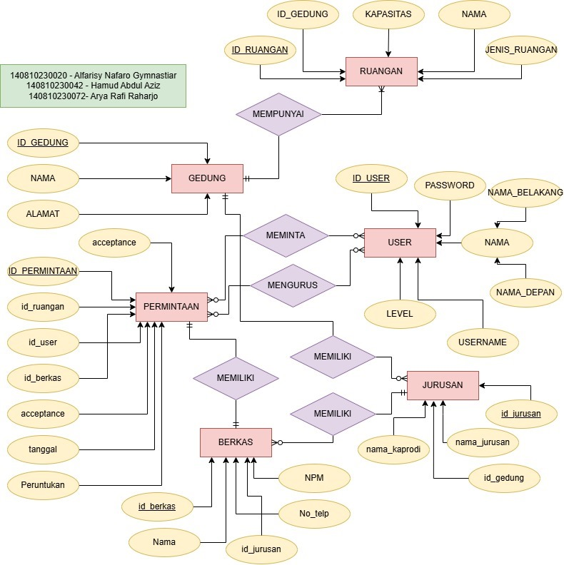
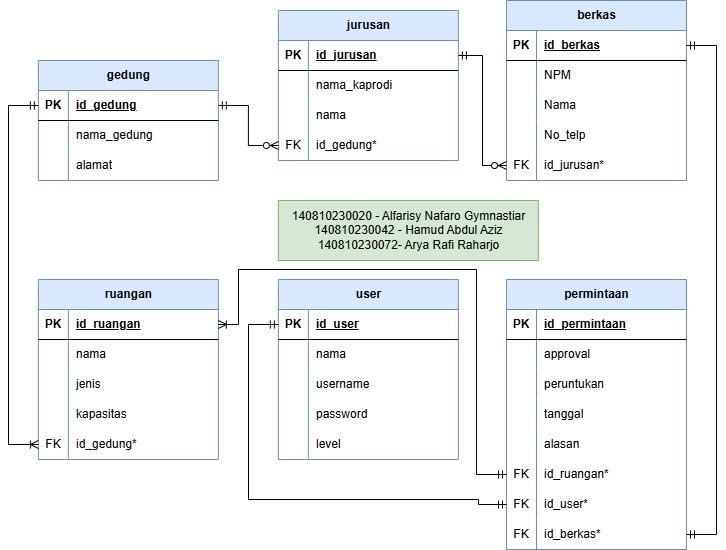

# Proyek Sistem Peminjaman Ruangan FMIPA

## Anggota Kelompok Pronak
Nama | NPM | Bagian
--- | --- | ---|
Alfarisy Nafaro Gymnastiar | 140810230020 | Front-end
Hamud Abdul Aziz | 140810230042 | Front-end
Arya Muhammad Rafi Raharjo | 140810230072 |Back-end

## Deskripsi Aplikasi
Sistem ini dirancang untuk memfasilitasi proses peminjaman gedung yang lebih efisien dan terstruktur bagi mahasiswa,mengatasi berbagai kendala yang selama ini dihadapi dalam pengelolaan peminjaman gedung secara manual. 

### ERD dan Tabel
- ERD  

- Table  

### Fitur Akun
> Terdapat 2 level pada sistem ini
- Admin
    - Dapat meng _approve_ permintaan peminjaman dari user
    - Dapat melakukan CRUD pada gedung
    - Dapat melakukan CRUD pada Ruangan
- User
    - Dapat melakukan permintaan peminjaman yang akan di _approve_ oleh Admin
    - Dapat download hasil penyuratan dari peminjaman ruangan yang sudah di _approve_ oleh Admin

## Cara Penggunaan
- Clone / Unzip Folder ini
- Lakukan command `composer update` untuk sinkronisasi
- Lakukan command `cp .env.example .env` agar bisa menggunakan env lokal
- pada `.env` masukkan seperti dibawah
>  DB_CONNECTION=mysql  
>  DB_HOST=127.0.0.1  
>  DB_PORT=3306  
>  DB_DATABASE=peminjamanruanganfmipa  
>  DB_USERNAME=root  
>  DB_PASSWORD=   
>  sesuaikan dengan database masing masing

- Lakukan command `php artisan migrate:fresh --seed` agar table dari database bisa terbuat dan terisi
- Lakukan command `php artisan serve` agar program berjalan
- Program sudah bisa dipakai
